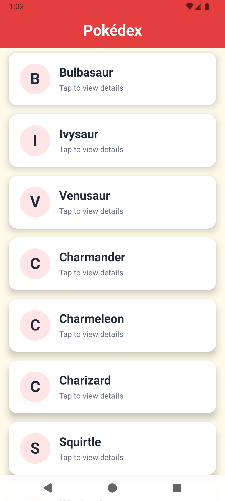

# PokeKMP - Pokémon Multiplatform App 🎮

A Kotlin Multiplatform Mobile (KMP) application showcasing shared business logic and
platform-specific UI implementations for browsing Pokémon data. This project demonstrates different
approaches to code sharing between Android and iOS platforms.

## 🚧 Work in Progress

This project is currently under active development. The core architecture is in place, but many
features are still being implemented.

## 📸 Screenshots

### Pokemon List Screen (Shared UI)

| Android                                       | iOS                                   |
|-----------------------------------------------|---------------------------------------|
|  |  |

### Pokemon Detail Screen (Platform-Specific UI)

| Android (Compose)                                 | iOS (SwiftUI)                             |
|---------------------------------------------------|-------------------------------------------|
|  |  |

## 🏗️ Architecture Overview

### Shared Components
- **Pokemon List Screen**: Fully shared using Compose Multiplatform
- **ViewModels**: Shared business logic for both screens across platforms
- **Data Layer**: Repository pattern with network client
- **Domain Models**: Common data structures and business rules

### Platform-Specific Components

- **Pokemon Detail Screen**:
  - **Android**: Native Compose UI implementation
  - **iOS**: Native SwiftUI implementation with shared ViewModel integration

## 🛠️ Dependencies

### Core Framework

- **Kotlin Multiplatform** - Enables code sharing across platforms
- **Compose Multiplatform** - Cross-platform UI toolkit for shared screens

### Dependency Injection

- **Koin** - Lightweight dependency injection framework
  - Used for managing ViewModels and repositories across platforms

### Networking

- **Ktor** - Multiplatform HTTP client
  - `ktor-client-okhttp` - Android HTTP engine
  - `ktor-client-darwin` - iOS HTTP engine
  - `ktor-client-content-negotiation` - JSON serialization support
  - `ktor-client-logging` - Request/response logging
  - `ktor-serialization-kotlinx-json` - Kotlinx serialization integration

### UI & Lifecycle

- **Androidx Lifecycle** - Lifecycle-aware components
  - `lifecycle-viewmodel-compose` - ViewModel integration with Compose
  - `lifecycle-runtime-compose` - Lifecycle runtime for Compose
- **Androidx Activity** - Activity management for Android
- **Material 3** - Modern Material Design components

### Platform Targets
- **Android**: API 24+ (Android 7.0+)
- **iOS**: arm64 and Simulator arm64 architectures

## 📱 Screen Architecture

### Pokemon List Screen (Fully Shared)

```
commonMain/
├── PokemonListScreen.kt          # Compose UI implementation
├── PokemonListViewModel.kt       # Business logic
├── PokemonListUiState.kt        # UI state models
└── PokemonListNavigation.kt     # Navigation setup
```

- **Shared across both platforms** using Compose Multiplatform
- Features list of Pokémon with loading, error, and success states
- Material 3 design with custom theming

### Pokemon Detail Screen (Platform-Specific UI)

```
commonMain/
├── PokemonDetailScreen.kt        # expect declaration
├── PokemonDetailViewModel.kt     # Shared business logic 
└── PokemonDetailUiState.kt      # Shared state models 

androidMain/
└── PokemonDetailScreen.android.kt # Compose implementation

iosMain/
├── PokemonDetailScreen.ios.kt     # UIKitViewController bridge
└── NativeViewFactory.kt          # Platform abstraction

iosApp/
├── PokemonDetailViewModelWrapper.swift  # StateFlow observer
└── PokemonDetailScreenContent.swift     # SwiftUI implementation
```

**Key Architecture Points:**

- **Shared ViewModel**: Same business logic and state management across platforms
- **Platform-specific UI**: Android uses Compose, iOS uses SwiftUI
- **State Synchronization**: iOS wrapper observes Kotlin StateFlow and updates SwiftUI
- **Native Experience**: Each platform follows its respective design patterns

## 🔧 Technical Implementation

### iOS Integration Pattern

The iOS side demonstrates advanced KMP integration:

1. **StateFlow Observation**: Custom `StateFlowObserverKt.observeStateFlow()` bridges Kotlin
   StateFlow to Swift
2. **ViewModel Wrapper**: SwiftUI `ObservableObject` that wraps the shared Kotlin ViewModel
3. **Native View Factory**: Abstraction layer for creating platform-specific views from shared code
4. **UIKitViewController**: Bridge between Compose navigation and native iOS screens

## 🎯 Current Features

- [x] Pokémon list with loading states
- [x] Navigation between screens
- [x] Shared ViewModels with platform-specific UI
- [x] Network client setup with Ktor
- [x] Dependency injection with Koin
- [x] Material 3 theming
- [x] iOS StateFlow integration
- [ ] Detailed Pokémon information display
